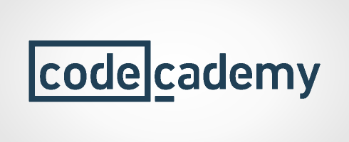

# CodeCademy Linear Data Structures with Python

This contains the projects from CodeCademy Linear Data Structures with Python program, used to practice and improve on getting experience with Python programming language.

Verify certificate at https://www.codecademy.com/profiles/contrerasgonzalezluisfcogmail.com/certificates/79735c9d76222d32368a4e4f1fb2580f

URL to CodeCademy:

https://www.codecademy.com/learn/linear-data-structures

For more certifications and complete profile please check my
LinkedIn:

https://www.linkedin.com/in/luis-francisco-contreras-gonzalez-45791715a/
